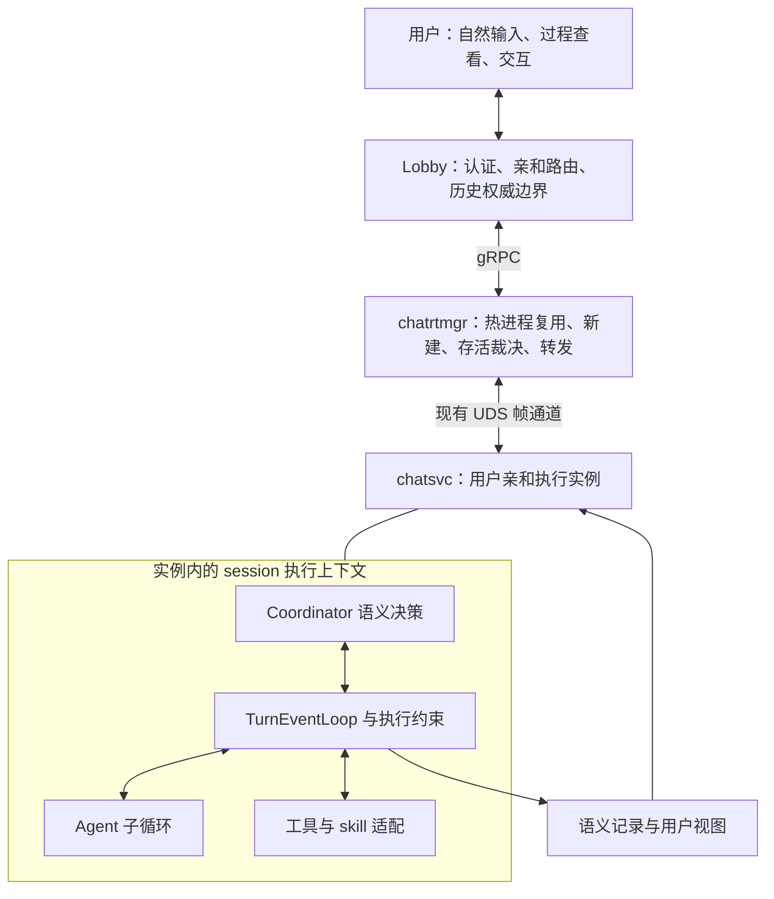
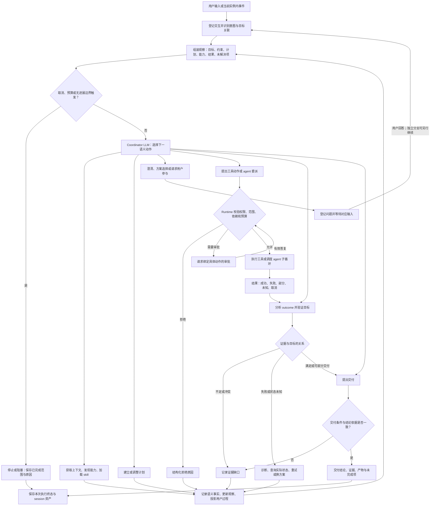
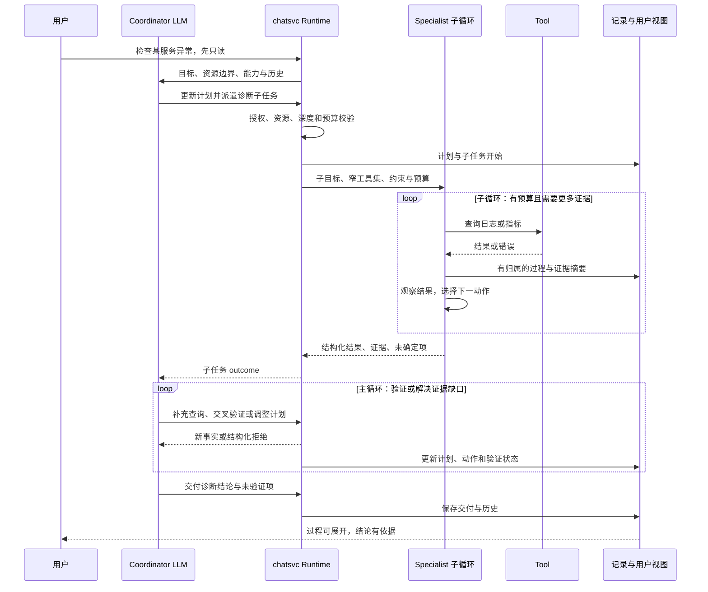
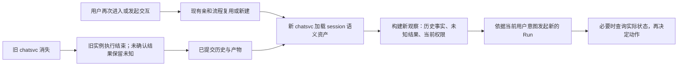

# Coordinator 语义运行时（前序设计：原 chatsvc 内置方案）

> 状态：前序设计，已演进为 [Hermes Headless Harness 内核设计](./hermes-headless-harness.md)。本文保留语义模型和演进背景，不再作为 coordinator 部署位置与执行权归属的当前设计依据。
> 日期：2026-09-08。
> 历史实施计划：NetworkClaw 仓库的 `.codebuddy/plan/coordinator_kernal/00_overview.md`；
> 该文件不随 Harness 交付，本仓当前计划以 [`plan/`](./plan/) 为准。
> 需求来源：本轮产品设计讨论——保持用户亲和与三层架构，以丰富 coordinator LLM 语义为改造中心，支持可见、可交互、可交付的自主工作过程。
> 归档：按本次要求放置于 `docs/architecture`。实施前关联对应 PRD、拆解开发计划，并将涉及执行控制、持久化权威边界的决策记录为 ADR；本次仅交付设计，不修改运行代码、API 或部署。

## 当前架构解释：从 chatsvc 内置 coordinator 演进为独立 Harness 内核

本文最初提出在 `chatsvc` 内扩展 coordinator 的语义和执行循环。后续设计保留本文定义的
目标、计划、工具、agent、澄清、审批、证据、交付和恢复等语义，但改变了执行内核的
归属：coordinator 不再作为 `chatsvc` 内部实现继续扩张，而是迁移到独立维护的
`networkclaw-harness`，并由 Hermes Headless Harness 承担完整 agent loop。

当前目标架构中的职责是：

```text
lobby -> chatrtmgr -> chatsvc A -> NetworkClaw Headless Harness A
                  \-> chatsvc B -> NetworkClaw Headless Harness B
                         host          coordinator / agent 内核
```

- Harness 是会话内部唯一的模型决策、计划推进、工具调度和上下文内核；Lobby durable
  边界保存 session 语义权威，workspace 保存带 cursor/epoch 的可校验运行快照和 artifact。
- `chatsvc` 负责宿主协议、进程生命周期、会话输入输出转发以及与既有链路的适配；它不再
  保留一套并行 coordinator loop，也不解析模型文本来推断执行状态。
- 进程关系固定为 `chatsvc : Harness = 1 : 1`；一个专属 Harness 可以承载所属 chatsvc 的
  多个 session，但不得被其他 chatsvc 共享。详细约束见
  [Harness 进程形态：chatsvc 与 Harness 1:1](./process-topology.md)。
- 本文中“Coordinator 的决策与对局执行留在 chatsvc”等表述是前序方案的历史记录，已被
  Headless Harness 设计替代，不能用于指导当前工程实现。
- Harness 验收前暂不改动现有 Go 服务，只是为了先独立验证新内核；这不表示最终架构会在
  `chatsvc` 和 Harness 中长期保留两套 coordinator。

## 1. 宗旨与边界

本次建设的是对局自身的工作能力。Coordinator 能理解目标、获取上下文、发现能力、制定计划、调用工具、委派 agent、观察结果、验证假设、纠错、与用户交互，并根据反馈持续选择下一步，直到交付或明确停止。

参照 Codex 类产品的行为覆盖广度，追求丰富且连通的语义体系，不以最小动作集合为目标。本文的英文语义名均为本项目建议名称，不是 Codex 官方协议清单，也不声称掌握其内部实现。此前讨论中对厂商协议的名称推测不作为本项目设计依据。

### 1.1 已确认原则

1. **历史决策，已被后续设计替代。** 原方案保持 `lobby → chatrtmgr → chatsvc` 三层架构，并将 Coordinator 的决策与对局执行留在 chatsvc；当前方案保留既有服务链路，但把 coordinator/agent 内核从 chatsvc 分离到独立 Headless Harness。
2. **保持用户亲和设计。** Lobby 的路由提示与 chatrtmgr 的进程存活裁决继续分离，优先复用用户的热进程；一个进程可以承载该用户多个 session，不能把“对局”类比误解为强制一 session 一进程。
3. **当前先做好单用户对局。** 使用方式简单、高效；多人加入同一对局、多人审批仲裁和协作控制权后置。
4. **语义丰满是主线。** 传输、持久化、前端按语义需要适配，不先建设通用分布式工作流平台。
5. **领域无关。** 面向运维、网络、数据查询及其他工具任务；编程只是可能的应用领域。
6. **不重启旧 svc，不恢复执行现场。** 旧实例消失后，按既有亲和流程新建实例并加载 session 历史；不恢复 goroutine、调用栈、旧进程句柄或原执行队列，不自动续跑旧任务。
7. **尽量保存有用的语义资产。** 历史目标、计划、动作、结果、审批、证据、交付和未解决问题都应可加载；不保存凭据或隐藏内部思维链。
8. **用户能看到大部分有意义的过程。** 计划、动作、结果、纠错、等待和交付可见，内部策略实现与敏感内容隐藏。

### 1.2 成功标准

同一个需求进入对局后，coordinator 能更自主、连贯、有证据地推进；用户看得懂进度，能自然补充、回答、批准、纠正和叫停。增加语义的价值用完整任务轨迹验证，不能以新增工具名或事件数验收。

## 2. 现状与可复用基础

以下为本次读取代码及已有设计得到的局部评估，不是全仓功能审计。旧文档应优先读取顶部“已实施 overlay”，不能把其历史设计段落当作当前实现。

| 能力 | 现有依据 | 本次演进方向 |
|---|---|---|
| 自驱动模型—工具循环 | NetworkClaw `internal/chatsvc/ai/loop.go`，模型流末判断 ToolCalls、工具执行后回灌 | 保留执行内核，在既有控制点增加语义契约和反馈，不另建争夺控制权的 FSM |
| Coordinator 装配 | NetworkClaw `internal/chatsvc/ai/handler.go`，按请求追加控制工具和观察视图 | 扩展行为能力与每轮观察，避免只靠更长 prompt |
| 能力发现与委派 | NetworkClaw `dispatch_tool.go`、现有 `search_agents` | 保留批量派遣、授权快照、结构化拒绝；补工具发现、结果检查及可控交互 |
| 约束与预算 | NetworkClaw `dispatch_guard.go`、`wave_budget.go` | 继承资源、深度、重复派遣和预算约束；补无进展检测与跨重试总预算 |
| 澄清 | NetworkClaw `ask_user.go`，发出澄清状态并提示模型收尾 | 建立问题身份、答案关联及运行时等待边界；当前提示模型收尾不等于确定性挂起 |
| 过程流 | NetworkClaw `stream_events.go`，text/reasoning/tool/turn_end/run_state 及 agent 归属 | 扩展计划、审批、证据、交付与持久记录；当前观测钩子不能直接充当可靠事实账本 |
| Session Memory | NetworkClaw `memory_projector.go` 和原 Coordinator Harness 设计 | 保留 Projector/Validator 和 Lobby 权威写入；记忆摘要不能代替完整语义事实 |
| 历史加载 | NetworkClaw `session/lobby_history.go`，Redis 缓存、Lobby durable 历史回源 | 从消息历史扩展到语义资产；当前 role/content 加载不是完整工具轨迹重建 |
| 边做边看 | NetworkClaw `live-commentary-loop.md` 的 Turn 事件循环设计 | 保留流末路由、实时 commentary 与现有卡片，增加语义驱动展示 |

当前基础已经支持递归反馈的雏形。主要缺口是计划、交互、审批、验证、纠错和交付之间缺少完整且稳定的行为契约，以及过程资产的长期保存与加载。

## 3. 前序方案的职责与承载对象（部署位置已失效）

### 3.1 历史承载图：三层架构不变

> 注意：下图记录最初把 coordinator 放在 chatsvc 实例内的方案，仅用于解释语义设计的
> 来源。当前目标拓扑以 [Hermes Headless Harness 内核设计](./hermes-headless-harness.md)
> 为准，coordinator/agent loop 位于独立 Harness 中。



当前代码中 lobby 与 chatrtmgr 使用 gRPC，chatrtmgr 与 chatsvc 使用 UDS 帧通道。本文不引入 chatsvc gRPC server，也不为语义改造替换这条链路；协议两端按需增量适配。前端事件与持久化请求沿现有服务边界传递，禁止跨 domain 直接 import。

### 3.2 统一术语，避免 turn 歧义

| 对象 | 定义 |
|---|---|
| Session | 长期会话历史与语义资产的归属；与当前 svc 实例分离 |
| Interaction / User turn | 每次用户输入或交互，均获得身份并被语义识别 |
| Goal / Task | 用户希望达成的目标；补充约束、回答审批可关联已有目标，不机械创建新目标 |
| Run | 当前实例中一次受预算约束的协调执行；新实例不能冒用旧 run 身份 |
| Model step | 一次模型调用及其响应；当前代码里的 loop turn / `turn_end` 接近此概念，不能直接等同用户任务完成 |
| Item / Invocation | 计划更新、问题、审批、工具调用、agent 调用、证据或交付等可追踪单元 |
| Outcome | 对动作结果的结构化观察，区分执行状态、业务结果与证据可信度 |
| Event | 某对象发生的变化；对象、动作、事件不混成一个枚举 |

上述是逻辑模型，不要求每个对象独立建表或变成新的外部 API。保留现有协议 turn 字段含义，新增字段时显式映射。

## 4. Coordinator 语义契约

语义不是一句提示，也不是 UI 状态名。一个语义应定义：适用条件、输入引用、权限及预算边界、执行行为、结果类型、后继路径、持久化内容和用户展示。

三种实现主体必须分开：

- **LLM 决策语义**：选择、计划、分析、请求、交付，输出结构化动作或简要结论。
- **Runtime 执行语义**：校验、授权执行、调度、取消、等待、记账；不能由模型自行宣称已完成。
- **事实与展示事件**：输出到达、审批解决、调用结束等，供下一轮观察和前端投影。

不要求每个英文名成为一个独立 tool。自然语言理解等可在模型调用中完成；计划、审批、执行、证据和交付等影响后续行为的结果必须有结构化载体。Runtime 不从 commentary 文本猜测状态。

## 5. 完整语义域

以下为目标覆盖，不代表一次上线全部开放。表中“下一步”是实现验收重点：每个域必须真正接回 coordinator 循环。

| 语义域 | 建议语义 | 结果与下一步 | 用户可见内容 |
|---|---|---|---|
| 1. 指令与上下文 | `load_instructions`、`resolve_constraints`、`inspect_environment`、`retrieve_context`、`load_skill`、`compact_context`、`restore_context` | 形成带来源、版本、适用范围的上下文；缺失则继续检索或询问 | 加载了什么能力、关键约束和资料摘要 |
| 2. 能力发现 | `discover_tools`、`inspect_tool`、`discover_agents`、`inspect_agent`、`check_availability` | 返回可用能力、边界、失败原因；接选择或换方案 | 查找能力、可用或不可用原因 |
| 3. 目标与计划 | `establish_goal`、`plan`、`update_plan`、`select_action`、`replan` | 保存目标、验收条件、计划版本、依赖；驱动下一动作 | 简洁计划、完成进度、调整原因 |
| 4. 用户交互 | `report_progress`、`request_clarification`、`request_decision`、`receive_input`、`steer_execution`、`deliver_result` | 关联问题或旧目标，更新约束；等待相关分支或继续 | 进度、问题、选择、最终交付 |
| 5. 授权审批 | `evaluate_permission`、`request_approval`、`resolve_approval`、`request_escalation`、`enforce_boundary` | 确定性允许、拒绝、等待；只有有效授权进入执行 | 具体操作、目标、影响和批准范围 |
| 6. 工具执行 | `invoke_tool`、`execute_command`、`apply_change`、`receive_output`、`interact_with_process`、`await_execution`、`cancel_execution` | 调用身份、输出、变更、终态或状态未知；回灌 outcome | 动作卡片、输出摘要、变更及执行状态 |
| 7. Agent 协作 | `spawn_agent`、`delegate_task`、`send_agent_message`、`inspect_agent_status`、`await_agent`、`collect_agent_result`、`reconcile_results`、`interrupt_agent`、`close_agent` | 有边界的子任务与证据；父 coordinator 验证、整合或补派 | 分工、子任务过程、结果与冲突 |
| 8. 调度与让出 | `sequence_actions`、`parallelize_actions`、`wait_for_event`、`yield_control`、`resume_execution`、`interrupt_execution` | 维护依赖、等待原因、可运行分支；外部事件重新进入决策 | 当前做什么、等什么、可否停止 |
| 9. Outcome 与验证 | `observe_outcome`、`interpret_outcome`、`validate_artifact`、`verify_goal`、`record_evidence` | 区分成功、证据不足、冲突和状态未知；继续验证、改计划或交付 | 事实、证据、未验证项、不确定性 |
| 10. 纠错与补偿 | `classify_failure`、`retry_action`、`switch_approach`、`reconcile_state`、`revert_change`、`compensate_effect` | 有界重试、查询实际状态或另选方案；补偿也要授权和验证 | 为什么重试、如何调整、补偿结果 |
| 11. 生命周期 | `complete`、`fail`、`request_cancel`、`confirm_cancelled`、`interrupt`、`block`、`expire` | 结束或暂停正确层级，保留未解决问题与已完成范围 | 完成、失败、等待、停止及部分结果 |
| 12. 会话连续性 | `start_session`、`load_session_history`、`checkpoint_progress`、`summarize_history`、`fork_context`、`archive_session` | 保存并加载语义资产；分支复用历史，不复制正在执行的副作用 | 历史过程、可参考成果、归档或分支 |

### 5.1 上下文与 skill

Skill 提供任务方法、约束、步骤建议和验收标准；tool 提供具体能力；coordinator 负责通用推进机制。新增运维 skill 不应重新实现审批、等待、重试与交付。

加载 skill 不授予权限。工具 schema、模型可见能力和 Runtime 允许执行的集合必须一致。网页、工具输出、日志都是外部数据，不能覆盖系统或用户约束。摘要保存来源引用和未知项，不将模型推测升级为已确认事实。

### 5.2 计划与交付

“执行检查”是计划步骤，“故障原因有证据支持”是验收条件，两者分开存储。简单问答可以直接交付，无需强制生成长计划或调用工具。复杂任务的最终交付包含结论、依据、已执行动作、验证范围、未完成事项及相关产物引用。

模型无 ToolCalls 只表示本次模型停止提出工具调用。对于执行型目标，交付需要检查必要验收项；证据不足可以诚实交付部分结果或进入阻塞，不能把流结束自动解释为目标达成。检查本身也受预算限制，不用无限强制补派来阻止结束。

### 5.3 用户输入识别

每次输入都登记 Interaction，然后识别为新目标、回答问题、解决审批、补充约束、纠正方向、查询进度、请求解释或取消。目标关联记录明确，不靠拼接文本猜测审批结果。歧义只在影响后续正确动作时澄清。

执行中输入在安全边界更新观察与约束版本。取消由独立控制路径立即作用于 ctx 和可取消调用，不能排队等下一次 LLM 回答。相关依赖已失效的待执行动作必须重新检查。

### 5.4 执行与 agent

`apply_change` 是通用变更：文件、设备配置、服务操作都可作为类型化变更，不把文件 diff 强加给所有领域。工具描述需声明副作用、可查询状态、可取消性、幂等支持和输出契约；不支持的能力明确返回，不假装所有工具都能暂停、回滚。

沿用 agent 即工具及共享循环内核。初始保留当前主 coordinator → specialist 的深度约束；语义反馈递归不等于开放无限 agent 递归。消息交互与单 agent 取消属于目标能力，但当前同步批量 barrier 不应被描述为已经支持；需要后续增加调用句柄与控制接缝。

## 6. Coordinator 语义调用递归循环图

### 6.1 主循环：每次结果都能改变下一次决策

“递归”指结果进入新的语义判断，以及主循环调用子循环。实现继续采用有界迭代与显式调度，不使用无限函数递归，也不将全部节点设为每次必经步骤。



审批答复为拒绝时，校验分支返回结构化拒绝，不再次循环索取相同授权；授权过期或参数变更需要重新校验。图中的记录节点为逻辑汇聚：审批、问题、执行意图和执行结果均在各自边界记账，不能等整轮结束才保存。

### 6.2 主循环与 agent 子循环



### 6.3 控制循环的不变量

- Coordinator 选择动作，Runtime 决定动作是否可执行，前端只投影事实。
- 主/子循环都有步数、时间、输出与并发预算；重试、换方案、补派不能重置总预算。
- 对同目标、相同动作与相同输入持续得到相同结果进行无进展检测；触发后调整方案或交付阻塞原因。
- 参数错误、权限拒绝、工具失败以明确结果回灌，使模型能够纠错；取消、协议损坏等不可继续条件由 Runtime 收口。
- 只对独立且无资源写冲突的动作并发，避免两个 agent 同时修改相同目标。
- 子任务完成不等于父目标达成；工具正常退出不等于业务成功。
- 等待不靠 LLM 自己“保持等待”；问题、审批、异步句柄和可运行分支由 Runtime 管理。
- 过程事件观察器不能成为第二个执行引擎；必要持久化失败则进入明确降级或停止路径，不静默丢弃后继续高副作用动作。

## 7. 状态与交互闭环

不建立覆盖所有对象的单一巨型状态枚举。Run、Invocation、Interaction 各自拥有状态，Outcome 单独记录结果和证据。

| 层级 | 建议状态或属性 | 关键区别 |
|---|---|---|
| Run | running、waiting、completed、failed、cancelled、interrupted、blocked、expired | completed 表示本次执行交付结束，不默认所有业务目标成功 |
| Invocation | queued、running、succeeded、failed、cancel_requested、cancelled、unknown | 取消请求不是取消确认；连接断开可能产生 unknown |
| Interaction | pending、answered、rejected、expired、superseded | 答复绑定问题/审批身份与版本，重复答复幂等 |
| Outcome | result、evidence_refs、confidence/source、unresolved、effects | 部分完成可以伴随 blocked/cancelled，不强塞为互斥终态 |

暂停/继续只描述活实例内受支持的等待和调度；不承诺暂停任意 shell 进程。前端断连是否终止执行沿用当前行为作为迁移基线，不能在本次设计中默认为后台持续执行；若后续改变，须单独定义断连与取消契约并验证。

## 8. 语义资产持久化与新实例加载

### 8.1 保存什么

| 内容 | 保存形式与目的 |
|---|---|
| 用户输入及关联 | 原交互、目标关系、约束版本；识别补充与回答 |
| 目标、计划、进度 | 当前快照与关键变更；新实例知道做到哪里 |
| 工具和 agent 调用 | 调用身份、脱敏参数、授权范围、起止事实、结果引用、错误；保留执行证据 |
| 问题和审批 | 请求内容、答复、操作者、版本、有效范围；不把历史批准无限延用 |
| 验证与交付 | 证据、产物、结论、未完成项；支持回看与新决策 |
| 上下文与 skill | 来源、版本、摘要、可重新获取的引用；避免加载后语义漂移 |
| 输出过程 | Commentary 与可展示摘要合并保存；大输出分块或以产物引用保存，并标注截断 |

不逐 token 强制写数据库，不存储凭据、隐藏思维链和不可复用的内存执行现场。Redis 仅作有 TTL 的有界缓存；长日志不塞大 key。沿用 lobby durable 权威边界，chatsvc 通过受控接口提交语义记录，chatrtmgr 不建立自己的业务账本。存储表结构、保留期限和产物后端在实施设计中确定。

### 8.2 保存时机

关键交互、审批、动作意图、动作终态、交付需有可靠提交语义；不能继续只搭最终 done 帧保存全部过程。已有 best-effort run_state 观测事件保留其展示职责，可靠事实记录使用显式确认的出口。

高副作用动作在必要意图与授权记录确认后执行；结果尽快提交。记录与外部副作用不能假设原子事务：执行后崩溃仍可能出现未知结果，必须如实保存或加载为 unknown，不能声称 exactly-once。

### 8.3 新实例加载流程与红线



加载历史不重放工具调用、不自动重新执行未完成计划、不继承旧 PID 或 agent 运行句柄。旧 running 记录作为“上次执行被中断、结果待确认”展示，不投影为新实例正在执行。历史审批可以作为事实查看，新动作仍按当前范围和授权有效性校验。

## 9. 用户体验与链路适配

### 9.1 简单入口，丰富过程

保持聊天入口与用户亲和。默认展示当前进度、当前动作、待处理问题和交付；计划、子 agent、工具输出、证据及历史按需展开。失败后正在自动纠错时，显示“检查失败，正在换一种方式”，而不是提前把整个任务标红为失败。

用户能看到计划变化、能力发现、委派、工具参数摘要、结果、验证、变更和交付；只提供允许展示的 reasoning 摘要或简要理由，不要求保存或披露原始内部思维链。凭据、敏感输出和内部系统指令在进入事件出口前过滤，不能只依赖前端折叠。

### 9.2 事件契约由语义反推

建议最小公共信封包含：`schema_version`、`event_id`、`session_id`、`instance_id`、`run_id`、`interaction_id`、`item_id`、`parent_item_id`、`sequence`、`actor`、`kind`、`occurred_at` 与类型化 payload；字段按事件适用性提供。

顺序定义在 run 内，跨 run 的 session 历史由权威存储分配游标，不能比较两个实例各自的本地序号。工具重试使用新的 invocation 身份并关联原调用；操作幂等键与事件去重键分开。已取消或结束 run 的迟到输出只能作为迟到事实，不能重新激活它。

关键记录与文本增量采用不同可靠性等级：终态、审批、证据不可静默丢失；文本增量可聚合，但最后保存的正文、摘要及缺口标记需一致。前端通过快照加后续事件重建视图，不能只靠聊天文本，也不要求首期实现完整事件溯源数据库。

协议实施先改 `.proto`，再适配 UDS 编解码、chatrtmgr gRPC、lobby 和前端；当前字段与帧含义保持兼容。未知非关键事件可降级展示，未知审批/执行控制语义必须拒绝相关动作，不能默认为已批准。

## 10. 领域示例：一次网络故障排查

用户：“业务访问数据库偶尔超时，帮我查一下，先不要修改。”

1. 识别目标、资源范围和只读约束，加载网络排查 skill；展示简短计划。
2. 发现可用网络与数据库 agent/tool；不可用能力返回原因，coordinator 选择替代查询。
3. 并发派遣独立的链路与连接池检查，用户看到各自过程；写操作被 Runtime 阻止。
4. 一个结果显示链路正常，另一个证据不足；coordinator 补查连接数和时间窗口，不把第一次返回当作结论。
5. 用户补充“只在晚高峰”，识别为目标修正，更新后续查询；不另起无关任务。
6. 交叉验证后交付“连接池耗尽”的证据和仍未验证的因素，明确没有修改。
7. 用户要求调整配置，形成关联的新执行请求；检查权限，必要时提交具体变更审批。
8. 执行后超时且状态未知，先查询配置是否生效，不能直接重试写入。
9. 验证配置和业务指标，交付变更、效果及补偿建议；将过程保存供以后加载。

这个案例覆盖发现、计划、委派、结果分析、补查、用户纠正、审批、执行、状态确认、验证与交付。Tool/skill 提供领域能力，通用循环负责将其连接。

## 11. 实施分解与验收

本节是待实施工作分解，不代表已完成开发节点。后续建立对应模块计划并逐项回写；本次不勾选已有项目计划中的实现任务。

| 阶段 | 重点 | 可交付验收 |
|---|---|---|
| A. 契约与基线 | 逐项确认现有语义入口、定义对象与来源、建立真实运维轨迹基线 | 已有/部分/缺失能力矩阵；当前行为可复现；关联 PRD/ADR 与实施计划 |
| B. 主循环丰满 | 计划、动态观察、能力发现、skill 加载、outcome 分类、验证、纠错、交付 | 无用户逐步指挥时能自主补查、换方案并有证据收口；预算到期有明确结果 |
| C. 可控交互与执行 | 澄清/审批身份、输入纠正、等待、异步工具交互、agent 控制 | 问题能正确续接；取消及时生效；拒绝审批后不执行；子任务反馈驱动主循环 |
| D. 过程资产与加载 | 将各阶段语义同步接入可靠记录、快照、产物引用和历史加载 | 新实例展示已提交过程，知道未知项，不自动续跑旧动作 |
| E. 全链路体验收口 | 完整事件投影、前端渐进展示、兼容与回归 | 直播与历史一致；用户输入简单；旧客户端降级明确 |

阶段表示语义主线的组织顺序，不表示等 B/C 全部结束才做持久化和 UI。每种语义按“决策—执行—结果—记录—展示”纵向交付，避免再次形成只在日志里存在的能力。完整目录保持目标覆盖，不因分期将未做语义从范围中删掉。

### 11.1 关键验收场景

- 简单问答直接交付，不强制计划或工具调用。
- 工具失败可纠错；相同失败反复出现触发无进展停止。
- 工具退出码为零但目标未满足，继续验证或交付未完成范围。
- `ask_user` 后受依赖动作确定性等待；回答关联正确目标，过期回答不误触发。
- 审批拒绝、过期、参数变化和重复提交都有明确结果；模型无法自行授权。
- 并行子任务保留正确归属，结果冲突能触发补查，单任务失败不误终止整个目标。
- 用户执行中补充约束能影响后续动作；取消请求与取消确认区别展示。
- 副作用发生后连接断开，结果记为未知，查询实际状态后再决定是否重试。
- svc 消失后新建实例仅加载历史；旧 running、旧审批及旧句柄不直接复活。
- 同一用户多个 session 在共享进程中互不串上下文、事件、预算和权限。
- 流式显示、最终记录与重新进入会话后的历史语义一致；未持久化区间明确可见。
- skill 增加新领域能力时无需重新实现通用循环、审批、等待和交付。

实现阶段对上述场景使用确定性模型/工具桩验证控制不变量，并用真实运维任务评估完成率、有效验证率、无效重复动作和用户干预次数。Go 测试按项目要求带 `-race`；不以每轮额外 LLM 自评分替代证据。

## 12. 风险、取舍与回滚

| 风险或备选 | 本设计取舍 |
|---|---|
| 只扩 prompt/工具描述，改动小 | 难保证等待、审批、终止及持久化正确性；选择结构化语义与 Runtime 契约配合 |
| 新建通用分布式工作流引擎 | 超出目标且与现有 loop 双重控制；选择在原循环内演进 |
| 语义工具全部一次性注入模型 | 工具选择成本与延迟增长；按能力域和当前上下文加载，Runtime 完整支持已开放契约 |
| 强制所有任务经过全套节点 | 增加用户等待和模型成本；简单路径直接交付，复杂路径按需展开 |
| 无限递归与大量补派 | 保留深度限制、总预算、无进展检测和资源冲突校验 |
| 可靠记录增加延迟 | 关键边界确认，增量聚合；明确记录失败后的执行边界 |
| 历史越多越好导致上下文膨胀 | 事实长期保存、摘要加索引按需加载；保留来源、不伪造模型工具消息配对 |
| 将分布式可用性等同实例恢复 | 只持久化和加载，禁止自动续跑旧实例动作 |

后续上线按 session/run 绑定语义版本和 feature flag，灰度验证后扩大。回滚停止接收新版 run 或待其明确收口，再切回旧路径；已记录资产保留且使用版本化读取。关闭语义能力不能让旧路径绕过未解决审批，也不能通过重启 chatsvc 实现回滚。本文仅新增设计文档，撤回本次文档及索引即可回滚本次变更。

## 13. 相关文档与设计自查

- NetworkClaw `docs/architecture/claude-code-harness.md`：沿用循环、工具控制入口、guard、agent 归属与 Memory；该外部历史文档不随 Harness 发布。
- NetworkClaw `docs/architecture/live-commentary-loop.md`：沿用事件循环；本设计提出过程持久化，属于对其旧版“不保存中间 commentary”策略的后续演进。
- NetworkClaw 的 Chat Service、chatrtmgr、Lobby 和 affinity 设计：服务边界、用户亲和与复用/新建裁决保持；本仓当前合同已在主设计和进程拓扑中自包含。

设计自查：

- [x] 已记录用户确认的目标、非目标、亲和设计与三层红线。
- [x] 已区分代码现状、目标语义及未实现能力，不冒称官方协议。
- [x] 已提供总体职责图、coordinator 递归反馈图、子循环时序和新实例加载图。
- [x] 已覆盖工具/skill 扩展、验证交付、循环边界、用户展示和语义持久化。
- [x] 已写明权限、安全、兼容、风险、备选与回滚原则。
- [ ] 实施前补齐关联 PRD、关键 ADR、模块计划及具体协议/存储设计。
- [ ] 实施后逐项完成行为验收、运行测试和上线检查；当前不标记为已实现。
