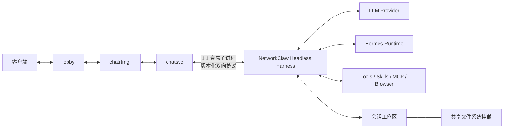

# Hermes Headless Harness 内核设计

> 状态：设计草案，待评审；本文不代表功能已实现。
>
> 日期：2026-09-17。
>
> 前序设计：[Coordinator 语义运行时](./coordinator-semantic-runtime.md)。本文不是与其并列的第二套 coordinator，而是该方案从“chatsvc 内置 coordinator”向“独立 Headless Harness 内核”的演进。在 Harness 自身通过验收前暂不修改现有 `chatsvc`、lobby、chatrtmgr 或 protobuf，这是分阶段迁移约束，不是最终职责划分。
>
> 进程形态决策：[Harness 进程形态：chatsvc 与 Harness 1:1](./process-topology.md)。一个 chatsvc 拥有一个专属 Harness 子进程，该 Harness 承载 chatsvc 的多个 session；禁止多个 chatsvc 共享同一个 Harness 进程。

## 0. 演进关系与最终职责

`Coordinator 语义运行时` 首先定义了对局自主推进所需的目标、计划、工具、agent、澄清、
审批、证据、交付和恢复语义，并最初设想把决策循环继续放在 `chatsvc` 内。本文保留这些
产品语义，但把 coordinator 的执行所有权迁移到新的 Harness 内核。

演进方向是单向且明确的：

```text
前序方案
lobby -> chatrtmgr -> chatsvc[coordinator + agent loop]

目标方案
lobby -> chatrtmgr -> chatsvc[host adapter] -> Harness[coordinator + agent loop]
```

目标状态下：

1. Harness 是会话内部唯一的决策者，负责模型调用、上下文、计划、工具、skills、memory、
   subagent、交互等待、恢复和终止判断。
2. `chatsvc` 不再实现或维护另一套 coordinator/agent loop；它负责托管 Harness 进程、转发
   输入与控制、接收结构化事件，并接回现有客户端链路。
3. “由 chatsvc 托管 Harness”只表示进程、协议和生命周期托管，不表示决策逻辑仍归
   `chatsvc` 所有。
4. 当前先独立建设 Harness，再改造 chatsvc 接线，是为了降低迁移风险并建立验收基线；
   接线完成后，旧 coordinator 路径应被替换，而不是与 Harness 长期双轨运行。
5. 进程部署采用 `chatsvc : Harness = 1 : 1`，会话部署采用 `Harness : session = 1 : N`；
   chatrtmgr 不托管一个供多个 chatsvc 共享的节点级 Harness。

## 1. 决策与目标

NetworkClaw 保留现有 `lobby -> chatrtmgr -> chatsvc` 分布式会话链路。建设两个职责不同的仓库：完整 Hermes fork 用于跟踪和验证 [NousResearch/hermes-agent](https://github.com/NousResearch/hermes-agent) 上游；独立的 `networkclaw-harness` 作为正式开发与客户源码交付仓库。交付仓库通过可重复的同步流程纳入固定 Hermes 提交中必要的运行源码，保留约 95% 的运行能力，排除 UI、网站、演示资源和其他非运行内容。

Harness 是由 `chatsvc` 托管进程和协议生命周期的无界面会话内核：它接收会话和用户操作，维护模型、上下文、工具、skills、memory、计划和工作区，并将经过筛选的过程事件返回给 `chatsvc`。`chatsvc` 再沿既有链路发送给客户端。这里的“托管”不包含 coordinator 决策权；决策循环完整归 Harness。

本设计的目标如下：

1. 保留 Hermes 的 agent loop、session、memory、context compaction、tool runtime、skills、MCP、browser、subagent、审批和用户澄清等成熟能力。
2. 用 Python 3.12 构建、测试和交付 Harness；所有 Python 依赖由受控环境产出离线 wheelhouse，不依赖客户 Nexus、PyPI 或运行时下载。
3. 让每个会话拥有由 NetworkClaw 分配的工作目录，可在新进程和新节点上读取同一会话的事实、产物和恢复状态。
4. 让客户端看到必要的回复、进度、工具、产物、澄清、审批、完成或失败过程，但不暴露内部提示、密钥、原始调试日志或不适合展示的大型数据。
5. 将 Harness 与 `chatsvc` 的关系固化为版本化协议，使 Harness 可以独立开发、测试、打包和发布。

“95%”指用户和宿主可用的运行能力覆盖，不指代码行数。终端渲染、桌面面板、主题、快捷键和 TUI 专用状态不是目标；支撑这些 UI 的 session、事件、审批、恢复和工具语义应继续保留。

Hermes 自带的自进化能力暂不纳入这 95% 目标。这里的自进化是指运行中的 agent 根据任务经验自动创建、修改、安装或发布 skill、tool、提示模板及其他可执行能力。该行为在多节点、共享文件系统、版本化交付和客户审计环境中会引入能力来源、并发修改、节点一致性、回滚和供应链等复杂问题，因此当前明确关闭。

## 2. 范围与非目标

本阶段包含 Harness 仓库和其内部运行时设计，不包含对现有 Go 服务的实现改造。

| 本阶段包含 | 本阶段不包含 |
| --- | --- |
| Hermes 上游 fork、可追溯 runtime snapshot、Headless 入口、工作区、事件投影、内置 tools/skills、离线制品 | 直接修改现有 `chatsvc` coordinator |
| Harness 与宿主的协议边界和版本策略 | 冻结或生成新的 protobuf |
| 会话恢复、工具副作用恢复原则、工作区安全边界 | chatrtmgr 的共享文件系统挂载实现细节 |
| Python 3.12 兼容、源码交付、wheelhouse、镜像和客户交付约束 | 客户运行时在线安装依赖或动态替换正在运行的内核 |
| 会话 memory、人工维护并随版本发布的 skills/tools | Harness 运行时自动创建、修改、安装或发布 skills/tools 的自进化能力 |

未来接线阶段，现有 chatsvc coordinator 将被 Harness host adapter 替换。该替换是既定迁移目标，只是不作为 Harness 独立内核建设与验收的实施前提；不得据此在最终架构中保留两套并行 coordinator。

## 3. 仓库与上游策略

完整 Hermes fork 与客户交付仓库分离，通过一条自动化生成链连接：

```text
NousResearch/hermes-agent                    官方上游
              |
              v
<organization>/networkclaw-hermes-fork       完整上游集成仓库
              |
              | 固定 commit + 文件清单 + patch series + 自动校验
              v
<organization>/networkclaw-harness           精简但完整的客户交付源码仓库
              |
              v
源码包 + Python 3.12 wheelhouse + OCI image  客户交付制品
```

`networkclaw-hermes-fork` 保留完整 Hermes 代码、测试和 Git 历史，承担上游研究、版本比较、兼容验证和补丁开发。它不是客户默认下载和继续开发的仓库。

`networkclaw-harness` 是我们开发团队和客户交付环境共同使用的正式源码仓库。它包含 NetworkClaw 所有宿主适配代码、内置 tools、skills、工作区实现，以及经过清单选择的 Hermes 必要运行源码。客户构建不需要访问另一个 Git 仓库、Git submodule 或公网。

Hermes 运行源码不能靠人工复制维护。交付仓库必须提供同步工具，按以下顺序生成或更新 vendor snapshot：

```text
读取 networkclaw-hermes-fork 的指定 commit
→ 按 allowlist 导出必要源码和资源
→ 应用 NetworkClaw patch series
→ 记录来源 commit 与每个文件 hash
→ 校验动态 import、工具注册和资源访问
→ 运行 Harness 能力与恢复回归测试
→ 更新许可证、第三方 notices 与 SBOM
```

同步完成后的 vendor snapshot 提交进 `networkclaw-harness` Git，因此交付源码自身完整、可审查、可离线构建。同步工具负责来源追溯；不能在仓库中同时保留一份完整 Hermes 源码和一份手工复制的精简源码。

MIT 许可允许该模式，但交付制品必须保留 Hermes 及全部第三方依赖的版权、许可证和 notices。SBOM 需要列出真实依赖，不能通过把源码合并进自有 wheel 隐藏第三方组件。

完整上游 fork 的本地布局保持 Hermes 原貌。正式交付仓库建议采用以下布局：

```text
networkclaw-harness/
├── src/
│   └── networkclaw_harness/
│       ├── host/                  # Headless 入口与 chatsvc host adapter
│       ├── protocol/              # 输入、事件、错误和版本契约
│       ├── workspace/             # 会话工作目录、artifact 与恢复适配
│       ├── projection/            # Hermes 事件到客户端可见事件的投影
│       ├── policies/              # 工具、文件、网络和资源策略
│       ├── tools/                 # 我们维护的内置 Python tools
│       ├── skills/                # 我们维护的内置 skills
│       └── profiles/              # 开发与客户部署 profile
├── vendor/
│   └── hermes/                    # 固定来源、必要且完整的 Hermes runtime snapshot
├── upstream/
│   ├── hermes-source.json         # 上游仓库、commit、同步时间和来源信息
│   ├── hermes-runtime-files.txt   # 允许进入交付仓库的文件/资源清单
│   └── patches/                   # 对 vendor runtime 的可追溯补丁
├── scripts/
│   ├── sync-hermes-runtime.py     # 从完整 fork 生成 vendor snapshot
│   ├── verify-hermes-vendor.py    # 校验来源、hash、动态资源与未声明修改
│   └── build-offline-release.py   # 构建源码包、wheelhouse 与发布清单
├── tests/
├── offline/                       # 锁文件、wheelhouse 产物元数据、SBOM 模板
├── deploy/
├── pyproject.toml
├── poetry.lock
└── Makefile
```

`vendor/hermes` 不是 Git submodule，也不是运行时下载依赖。它是交付仓库某个 Git 提交内的普通源码，由同步脚本生成并由 hash 校验。日常 skill/tool 和 NetworkClaw adapter 开发直接发生在 `src/networkclaw_harness`；需要修改 Hermes 核心时，先在完整 fork 或 patch series 中形成可追溯变更，再同步到 vendor snapshot，避免产生无法回溯来源的私有分叉。

不能在初期凭目录名称猜测必要文件。H0 阶段先验证完整 Hermes fork，再通过真实 import、动态加载、资源读取和能力测试逐步形成 `hermes-runtime-files.txt`。被排除的主要对象应是 TUI/桌面 UI、网站、文档站、演示素材和与 Headless 运行无关的开发资源，而不是未经验证地删除某个运行模块。

## 4. 目标架构



Harness 是会话内部的唯一决策者。它决定下一次模型调用、上下文、工具、计划推进、重规划和恢复动作。`chatsvc` 不解析模型文本来猜测这些状态，也不再维护另一份 agent loop。

进程形态固定为一个 chatsvc 对应一个专属 Harness。一个 chatsvc 本身可以承载多个 session，
其 Harness 承载相同归属范围内的这些 session，并以 `session_id` 严格隔离运行状态。Harness
不是一 session 一进程，也不是供 chatrtmgr 下多个 chatsvc 共同连接的节点级单例。

`chatsvc` 是 Harness 的 NetworkClaw host，负责：

1. 将用户会话、输入、补充、取消和审批结果转给 Harness。
2. 分配并传入会话身份、租户身份、模型配置引用、资源限制和工作目录。
3. 接收 Harness 结构化事件，将适合用户展示的部分映射到既有客户端协议。
4. 管理 Harness 子进程的启动、停止、监控和异常报告。
5. 与 chatrtmgr 协作保证同一会话的执行权唯一。

`chatrtmgr` 继续管理 chatsvc 的用户亲和、节点容量、排水、重启和 execution lease，但不直接
复用或向多个 chatsvc 分配同一个 Harness。Harness 的生命周期随所属 chatsvc 建立、排水、
重启和终止；chatsvc 异常退出时必须确保其 Harness 不成为孤儿进程。

Harness 不直接调用 lobby、chatrtmgr 的内部存储或业务代码。涉及 NetworkClaw 内部业务能力时，通过受控工具或正式 API/RPC 访问。

## 5. Headless Host 协议

Harness 与其唯一所属的 `chatsvc` 之间，初始传输可采用标准输入输出上的 JSONL：一行一个 JSON 对象，标准输出只写协议帧，日志只写标准错误。该传输依赖 1:1 子进程关系，不承担多个 chatsvc 的连接注册或事件路由。后续可将同一语义映射为 UDS、protobuf/gRPC，而不改变 Harness 的内部接口和 1:1 所有权。

协议至少需要覆盖以下语义：

| 方向 | 类别 | 示例 |
| --- | --- | --- |
| chatsvc -> Harness | 会话 | `session.open`、`session.resume`、`session.close` |
| chatsvc -> Harness | 用户控制 | `user.input`、`turn.steer`、`turn.cancel` |
| chatsvc -> Harness | 人机交互回执 | `clarification.answer`、`approval.resolve` |
| chatsvc -> Harness | 宿主控制 | `health.query`、`capabilities.query`、`shutdown` |
| Harness -> chatsvc | 生命周期 | `session.opened`、`turn.started`、`turn.completed`、`turn.failed` |
| Harness -> chatsvc | 用户可见过程 | `assistant.delta`、`plan.updated`、`tool.started`、`tool.completed` |
| Harness -> chatsvc | 需要用户操作 | `clarification.requested`、`approval.requested` |
| Harness -> chatsvc | 产物与诊断 | `artifact.created`、`warning`、`error`、`heartbeat` |

每个帧必须带 `protocol_version`、`session_id`、关联的 `turn_id` 或 `request_id`、单调递增的 `sequence`，以及明确的发生时间。`accepted` 与 `completed` 必须分离：输入被 Harness 接收不代表模型或工具已执行完成。

协议版本由 Harness 发布，chatsvc 选择兼容版本。具体字段和 protobuf 仅在 Harness 基线通过后冻结并生成；这样不会反向污染当前运行中的 coordinator 协议。

## 6. 会话工作目录与持久化

每次 `session.open` 或 `session.resume` 都由 chatsvc 显式提供工作目录，而不是由 Harness 根据用户输入、当前目录或本机临时路径推断。

```text
<mounted-session-root>/<tenant-id>/<session-hash>/
├── session-state/                 # Harness 会话状态、检查点、恢复元数据
├── artifacts/
│   ├── raw/                       # 原始网页、API、上传和工具输出
│   ├── normalized/                # 规整后的结构化资料
│   ├── evidence/                  # 可引用证据和报告输入
│   └── generated/                 # 代码、报告和其他最终产物
├── summaries/                     # 给模型按需读取的短摘要
├── indexes/                       # artifact、字段、引用和检索索引
└── tmp/                           # 可回收的本轮临时文件
```

目录内的精确状态格式是 Harness 的内部实现细节，可复用 Hermes 的 session persistence；但必须满足以下不变量：

1. 原始大型数据和中间结果留在工作区，模型只接收摘要、索引、路径和必要片段。
2. 工具开始、外部副作用意图、工具结果、当前计划和恢复检查点之间有可判定的顺序。
3. 新进程恢复时，能区分“已完成”“已取消”“等待用户”“可安全重试”和“结果未知”。
4. 有副作用的工具在结果未知时默认不自动重放；只读、显式声明可重试的工具才可重放。
5. `tmp/` 不承载恢复所需的唯一事实；恢复需要的内容必须写入状态或 artifact 区。
6. Harness 仅可读写被分配会话根目录及策略允许的路径，禁止通过相对路径或符号链接逃逸。
7. 同一 Harness 内多个 session 的上下文、缓存、工具状态、审批、取消、预算和事件序列必须按 `session_id` 隔离；进程级用户亲和不能代替 session 隔离。

共享文件系统解决“换节点后文件仍可访问”，不解决“双写者”问题。同一会话同一时刻只能有一个 Harness 执行者。chatrtmgr 是执行权租约的权威来源；Harness 持有由 host 传入的 execution epoch，并在写入或外部操作前校验其仍有效。共享 FS、会话 hash、租约存储和故障接管的精确方案另行设计。

## 7. 内核模块

以下模块共同构成 Headless Harness。除 `networkclaw_harness` 标记的模块外，优先复用 Hermes 实现；不要为获得统一目录而提前重写成熟能力。

| 模块 | 主责 | 实现来源 |
| --- | --- | --- |
| Headless launcher | 解析启动参数、建立 host 通信、设置 stderr 日志、受控退出 | NetworkClaw 新增 |
| Host protocol | 命令、事件、关联 ID、序列、版本协商、错误信封 | NetworkClaw 新增 |
| Session runtime | 创建、加载、关闭、历史、分支、压缩、状态查询 | Hermes 复用并适配 |
| Agent loop | 模型决策、工具回执、继续决策、终止条件 | Hermes 复用 |
| Provider runtime | Provider、模型、认证、流式响应、重试、用量 | Hermes 复用并接入 host 配置 |
| Context assembly | 系统提示、上下文文件、会话历史、附件、按需资料读取 | Hermes 复用并扩展工作区引用 |
| Compaction | 上下文预算、摘要、压缩、压缩后的恢复 | Hermes 复用 |
| Plan and replan projection | 计划、todo、当前步骤和状态变化的结构化投影 | Hermes 复用语义，NetworkClaw 映射事件 |
| Memory | 会话记忆、跨会话检索、来源和用户偏好 | Hermes 复用，受租户策略约束 |
| Skill runtime | skill 发现、提示注入、模板和参考资料 | Hermes 复用，内置于发布制品 |
| Self-evolution runtime | 自动生成、修改、安装或发布 skill/tool | 当前禁用；不进入能力目标与生产 profile |
| Tool runtime | 注册、schema 校验、超时、进度、结果截断、取消 | Hermes 复用并接入策略 |
| NetworkClaw tools | 受控内部 API、资料处理、文件检索、业务工具 | NetworkClaw 新增 |
| Shell and file tools | `rg`、`jq`、`git`、`curl`、Python 脚本和文件操作 | Hermes 复用，按 profile 限制 |
| MCP runtime | MCP 服务发现、调用、生命周期和错误处理 | Hermes 复用 |
| Browser runtime | 动态网页、页面读取、下载和浏览器控制 | Hermes 复用，按客户 profile 启用 |
| Subagent runtime | 委派、并行任务、子任务收集、取消和结果汇总 | Hermes 复用 |
| Clarification and approval | 向 host 请求用户回答或审批，等待并恢复 | Hermes 语义 + NetworkClaw 协议适配 |
| Event projection | 内部事件过滤、脱敏、聚合并映射为客户端事件 | NetworkClaw 新增 |
| Artifact and index service | 资料、产物、摘要、引用和检索索引的工作区管理 | NetworkClaw 新增 |
| Workspace guard | 工作目录绑定、路径验证、配额、临时文件回收 | NetworkClaw 新增 |
| Policy engine | 工具许可、文件范围、网络目的地、预算和客户 profile | NetworkClaw 新增，调用 Hermes 钩子 |
| Recovery reconciler | 进程中断后重建运行状态、处理未知工具结果 | Hermes persistence + NetworkClaw 工作区语义 |
| Observability and audit | 结构化日志、trace、事件审计、指标、诊断快照 | 双方整合 |
| Packaging and supply chain | CPython 3.12、wheelhouse、hash、SBOM、镜像、离线安装 | NetworkClaw 新增 |
| Upstream maintenance | 完整 Hermes fork 基线、runtime allowlist、补丁、vendor 同步、升级与兼容性测试 | NetworkClaw 新增工程流程 |

## 8. 事件可见性

Harness 产生的事件不应默认全部推给客户端。投影层按照产品、租户和安全策略选择可见信息。

| 事件类别 | 默认客户端可见性 | 示例 |
| --- | --- | --- |
| 助手最终回复与流式文本 | 可见 | 回复正文、必要进度文案 |
| 计划与执行状态 | 可见但简化 | 当前步骤、等待、完成、失败 |
| 工具调用 | 按工具策略 | 工具名、简短说明、状态、脱敏摘要 |
| Artifact | 可见元数据 | 名称、类型、大小、下载或查看引用 |
| 澄清和审批 | 可见且可交互 | 问题、选项、风险说明、超时 |
| 原始网页、完整命令输出 | 默认隐藏 | 仅作为 artifact 或管理员诊断 |
| 系统提示、思考内容、密钥、内部配置 | 永不透传 | 仅在受控内部诊断中处理 |

前台展示的每个事件都必须能追溯到 Harness 的 session、turn、工具调用或 artifact，但不要求把所有内部日志复制进前台历史。

## 9. 源码交付、Python 3.12 与运行制品

Harness 的交付不是只有一个容器或一个 Python wheel。用户需要能够下载完整源代码；我们的开发团队也要能够在交付给用户的代码仓库中继续开发 skill、tool 和内核适配。因此，正式交付的第一等对象是一个可构建的源码仓库，运行镜像和离线 wheelhouse 都从该仓库的同一个 Git 提交生成。

一次正式发布至少包含三类相互对应的制品：

| 制品 | 用户拿到什么 | 用途 |
| --- | --- | --- |
| 源码仓库 | NetworkClaw Harness 代码、必要且可追溯的 Hermes runtime snapshot、内置 tools/skills、测试、同步与构建脚本、锁文件和许可证 | 下载、审查、继续开发和重新构建 |
| 离线构建包 | CPython 3.12、全部 cp312 wheels、hash、SBOM、第三方 notices 和基础镜像引用 | 在无公网或 Nexus 依赖不完整的 CI 中重建 |
| 运行制品 | 从上述源码和依赖构建的 OCI 镜像，或可执行安装目录 | Kubernetes 和 Ubuntu 22.04 环境直接运行 |

源码仓库应包含可以直接开发的目录，而不是只提供构建后的 `site-packages`：

```text
networkclaw-harness/
├── src/networkclaw_harness/
│   ├── tools/                     # 我们继续开发的内置 Python tools
│   ├── skills/                    # 我们继续开发的内置 skills
│   ├── host/                      # Headless 入口与 host adapter
│   ├── protocol/                  # 协议源码和 schema
│   └── workspace/                 # 工作目录和 artifact 适配
├── vendor/hermes/                 # 交付所需的 Hermes runtime 源码
├── upstream/
│   ├── hermes-source.json         # 固定上游 commit 和来源元数据
│   ├── hermes-runtime-files.txt   # runtime 文件与资源 allowlist
│   └── patches/                   # NetworkClaw 可追溯补丁
├── scripts/
│   ├── sync-hermes-runtime.py
│   └── verify-hermes-vendor.py
├── tests/
├── offline/wheels/                # 发布时填充的依赖制品
├── requirements.lock
├── poetry.lock
├── Dockerfile
└── Makefile
```

开发团队在这份交付源码中增加或修改 skill/tool 后，必须走同一条发布链：

```text
修改源码 / skill / tool
→ 运行单元、协议和 Harness 回归测试
→ 生成新的 lock/hash/SBOM
→ 生成 Python 3.12 离线 wheelhouse
→ 从同一 Git commit 构建新的运行镜像
→ 更新源码版本、制品版本和 chatsvc 兼容信息
```

因此，skill 和 tool 在当前产品模型中属于 Harness 源码的一等组成部分。它们不是用户运行时临时下载的扩展，也不是与核心代码脱离版本的外部目录。需要单独发布时仍可将其拆成扩展包，但默认发布单元保持一致，便于审查、回滚和复现。

会话 memory 可以记录事实、偏好、证据和任务经验，也可以产生供开发人员评审的改进建议；它不能直接写入 skill/tool 源码、安装依赖、变更 tool registry 或形成新的生产能力。任何能力变化都必须由开发团队审查后，以普通 Git 提交进入源码仓库，再经过测试和发布链生成新 Harness 版本。

Harness 的 Python 运行目标固定为 CPython 3.12。所有 Python 依赖由受控环境产出离线 wheelhouse，不依赖客户 Nexus、PyPI 或运行时下载：

```text
networkclaw-harness source release
├── 完整源码仓库（可下载、可继续开发）
├── Hermes runtime snapshot 的固定来源、代码和补丁
├── networkclaw_harness 内置 skills 与 tools
├── CPython 3.12 runtime
├── requirements.lock + hashes
├── cp312 wheelhouse
├── SBOM 与第三方 notices
├── Ubuntu 22.04 系统工具清单
└── networkclaw-harness headless entrypoint
```

客户构建或安装必须在无公网条件下完成：

```text
pip install --no-index --find-links <wheelhouse> --require-hashes -r requirements.lock
```

客户 Nexus 可以缓存或分发该制品，但不能成为成功部署的隐含前提。新增 Python 依赖、原生扩展或系统工具时，由我们在受控构建环境产出目标 Ubuntu 22.04 和 CPython 3.12 兼容的离线制品，再更新 SBOM、许可证和漏洞扫描结果。源码仓库中的 `SOURCE_COMMIT`、wheelhouse manifest、镜像标签和协议兼容版本必须互相对应，避免“源码能构建出与交付镜像不同的 Harness”。

源码交付不等于允许运行时无控制地改文件。开发阶段可以直接修改源码并重启 Harness；验收和生产阶段只运行已审查提交生成的镜像或安装目录。任何 skill/tool 更新都通过新的 Git 提交和新的 Harness 版本进入运行环境。

## 10. 分阶段验收

先完成 Harness 内核闭环，再接入当前 chatsvc。建议按以下出口推进：

| 阶段 | 交付与验收出口 |
| --- | --- |
| H0：上游与裁剪基线 | 完整 fork 固定 Hermes 提交并通过 Python 3.12 基线；形成 runtime allowlist、来源清单和初始 vendor snapshot；许可证与依赖可复现 |
| H1：Headless 最小闭环 | Headless 入口可接收一条输入，流式返回文本、工具开始/结束和终态事件 |
| H2：工作区与资料闭环 | 一个会话将大量资料写入工作区，按索引局部查询，不将全集塞入模型上下文 |
| H3：交互与控制闭环 | 用户中途 steer、澄清、审批和取消可正确进入 Hermes loop 并回传事件 |
| H4：恢复闭环 | Harness 或 chatsvc 中断后，新的 1:1 进程对加载同一工作目录；只读工具可按策略恢复，有副作用工具不会盲目重放；旧 Harness 不成为孤儿且失效 epoch 无法继续写入 |
| H5：源码与离线交付闭环 | 仅凭交付源码仓库即可离线构建和运行，不依赖完整 fork/submodule/公网；Python 3.12 wheelhouse、镜像、SBOM 与源码提交一致 |
| H6：接线准备 | Host 协议 v1 稳定；模拟 chatsvc host 的兼容测试通过；此时才设计并改造 chatsvc/protobuf |

每个阶段都需有自动化测试和一条端到端演示。H4、H5、H6 未达到验收前，Harness 不进入客户版本，也不替换现有 coordinator。

## 11. 风险与后续决策

| 风险或未知项 | 处理原则 |
| --- | --- |
| Hermes 对 Python 3.12 的实际兼容性 | H0 固定上游提交后运行完整测试；不以文档推断代替验证 |
| Hermes 内部状态格式与工作区目录的冲突 | 保留 Hermes session persistence，通过 adapter 引入 artifact 和恢复元数据，避免双状态机 |
| 同一会话多节点并发写入 | chatrtmgr 提供唯一执行权；共享 FS 不充当分布式锁 |
| 多个 chatsvc 共享 Harness 导致多租户串线和节点级故障域 | 固定 `chatsvc : Harness = 1 : 1`；一个 Harness 仅复用所属 chatsvc 的多个 session，跨 chatsvc 共享需作为全新架构重新评审 |
| chatsvc 被终止后遗留孤儿 Harness | 子进程退出契约结合 parent-death signal、进程组、cgroup/container 或等价机制；E2E 覆盖正常退出与强杀路径 |
| 未知结果的外部副作用 | 持久化 intent 与 tool policy；默认 fail closed，不自动重放 |
| Hermes 上游升级冲突 | 完整 fork 保留 upstream remote；升级分支先验证上游，再更新 allowlist、patch series 和 vendor snapshot |
| Hermes 裁剪遗漏动态依赖 | 结合 import/resource tracing、能力矩阵和异常恢复测试维护 allowlist；不得只依据静态 import 判断 |
| vendor 源码被手工修改而失去来源 | `verify-hermes-vendor.py` 校验文件 hash 和 patch series；未声明修改阻断发布 |
| 客户环境禁用依赖或系统工具 | 在发布前生成离线依赖闭环和允许工具清单；禁用项必须替换，不以打包规避 |
| 源码、wheelhouse 与运行镜像漂移 | 以 Git commit 为发布根身份，构建清单记录源码提交、依赖 hash、镜像 digest 和协议版本 |
| 自进化导致节点能力漂移 | 生产 profile 禁用运行时 skill/tool 创建、修改和安装；改进建议只作为 artifact 输出，能力变更必须进入 Git 发布流程 |
| 协议过早冻结 | 先使用 headless host 模拟器验证事件语义，H6 后才生成正式 protobuf |

下一个设计输入应是“会话 hash、共享挂载根、execution epoch 与工作区所有权”的详细模型。该模型决定 chatrtmgr、chatsvc 与 Harness 如何在节点迁移和进程异常后安全接续同一会话。
